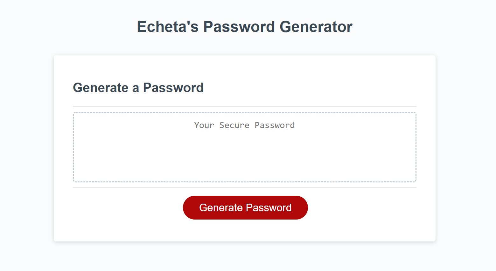

# Password Generator

## Purpose
This is a Password Generator that generates a random password based on the user inputs.
It allows the user to choose:
* Password length (8 to 128 characters)
* Whether to include Lowercase, Uppercase, Numeric or special characters (see here for list of special characters: https://owasp.org/www-community/password-special-characters)

## Screenshot

## Built With
* HTML
* CSS
* JavaScript

## Website
https://shookspear.github.io/password-generator/

## Contribution
Made with ❤️ by Echeta

### ©️2022 Echeta Okeke